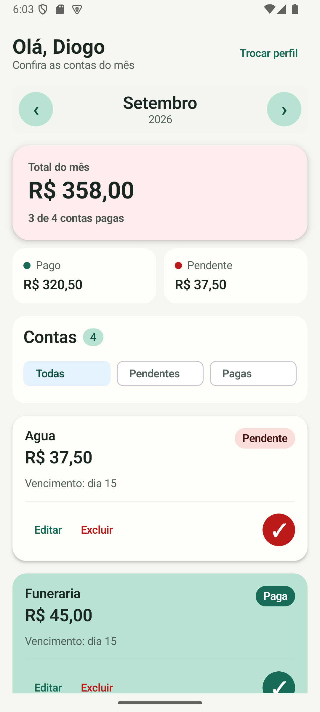
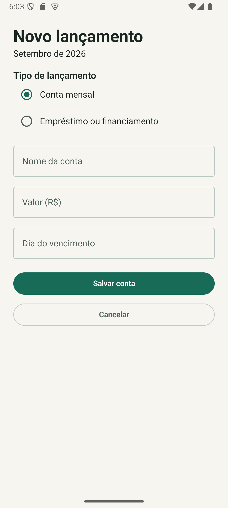
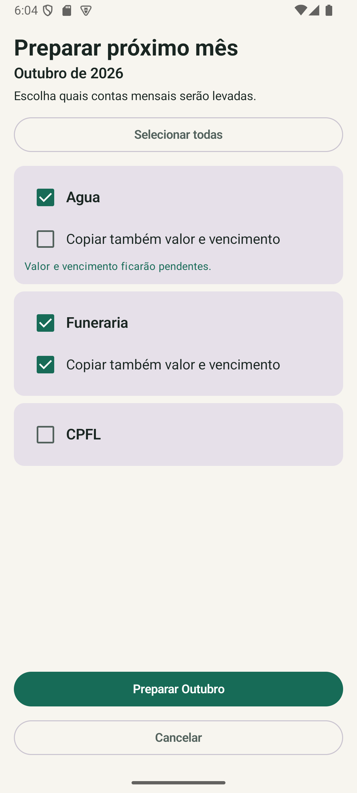
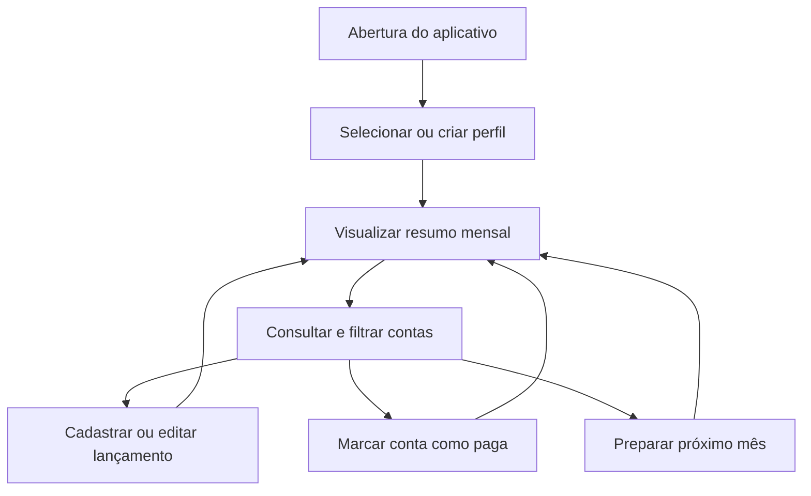

<h1 align="center">Contas da Casa</h1>

<p align="center">
  Aplicativo Android para organizar contas mensais, pagamentos e financiamentos de forma simples e visual.
</p>

<p align="center">
  
  
  
  
</p>

## Demonstração visual

<p align="center">
  
  &nbsp;&nbsp;
  
</p>

<p align="center">
  
  &nbsp;&nbsp;
  
</p>

## Sobre o projeto

O **Contas da Casa** é um aplicativo Android nativo desenvolvido para facilitar o controle das despesas domésticas.

O aplicativo permite separar os dados por perfil, acompanhar contas de diferentes meses, controlar pagamentos e cadastrar financiamentos com geração automática das parcelas.

Todos os dados são armazenados localmente no aparelho, sem necessidade de conexão com a internet ou criação de conta online.

## Principais funcionalidades

### Gerenciamento de perfis

- criação de diferentes perfis;
- seleção do perfil utilizado;
- renomeação de perfis;
- exclusão com confirmação;
- separação completa das contas de cada perfil.

### Controle mensal

- navegação entre meses;
- resumo financeiro com total, valor pago e valor pendente;
- indicação visual do estado financeiro do mês;
- quantidade de contas pagas;
- ordenação das contas pendentes antes das contas pagas.

### Organização das contas

- filtro por todas, pendentes ou pagas;
- cadastro de contas mensais;
- edição de valor e vencimento;
- exclusão de lançamentos;
- marcação rápida de pagamento;
- diferenciação visual entre contas pagas e pendentes.

### Financiamentos e parcelamentos

- cadastro da parcela atual e do total de parcelas;
- geração automática das parcelas futuras;
- edição somente da parcela selecionada;
- edição da parcela atual e das seguintes;
- exclusão somente da parcela selecionada;
- exclusão da parcela atual e das seguintes.

### Preparação do próximo mês

- seleção das contas que serão levadas para o mês seguinte;
- opção de copiar valor e vencimento;
- criação de contas pendentes de revisão;
- prevenção de duplicidade no mês de destino.

## Fluxo da aplicação



## Regras principais

- cada perfil possui suas próprias contas;
- contas mensais pertencem a um mês e ano específicos;
- financiamentos geram parcelas nos meses correspondentes;
- contas pagas aparecem depois das contas pendentes;
- o resumo mensal é atualizado conforme o estado dos pagamentos;
- a exclusão de um perfil remove também seus dados vinculados;
- valores monetários são armazenados em centavos para evitar erros de precisão.

## Tecnologias

| Tecnologia | Utilização |
|---|---|
| Kotlin | Linguagem principal |
| Jetpack Compose | Construção da interface |
| Material 3 | Componentes e identidade visual |
| Room | Persistência local |
| SQLite | Banco de dados no dispositivo |
| ViewModel | Gerenciamento de estado |
| Coroutines | Operações assíncronas |
| Gradle | Build e gerenciamento do projeto |
| Git e GitHub | Versionamento do código |

## Estrutura principal

```text
app/src/main/
├── java/com/diogo/contasdacasa/
│   ├── data/
│   │   ├── local/
│   │   ├── model/
│   │   └── repository/
│   ├── ui/
│   │   ├── bill/
│   │   ├── profile/
│   │   ├── splash/
│   │   ├── theme/
│   │   └── util/
│   ├── AppDestination.kt
│   ├── ContasDaCasaApp.kt
│   └── MainActivity.kt
└── res/
    ├── drawable/
    ├── mipmap/
    └── values/
```

## Execução local

### Requisitos

- Android Studio;
- Android SDK 26 ou superior;
- JDK compatível com o projeto;
- emulador Android ou dispositivo físico.

### Passos

1. Clone o repositório:

```bash
git clone https://github.com/diogozarpelo/contasdacasa.git
```

2. Abra a pasta do projeto no Android Studio.

3. Aguarde a sincronização do Gradle.

4. Inicie um emulador ou conecte um dispositivo Android.

5. Execute o aplicativo pelo botão **Run app**.

### Build pelo terminal

No Windows:

```powershell
.\gradlew.bat :app:assembleDebug --no-daemon --no-configuration-cache
```

O APK de desenvolvimento será gerado em:

```text
app/build/outputs/apk/debug/app-debug.apk
```

## Persistência local

Os dados são armazenados localmente por meio do Room e do SQLite.

O aplicativo não depende de servidor externo e continua funcionando sem internet. As migrações do banco preservam a compatibilidade com versões anteriores instaladas no dispositivo.

## Testes e qualidade

O projeto foi validado por meio de:

- compilação completa com Gradle;
- verificação de lint;
- testes dos fluxos de criação, edição e exclusão;
- testes de contas mensais e financiamentos;
- testes de navegação entre meses;
- testes de gerenciamento de perfis;
- validação da persistência após fechar e abrir o aplicativo;
- testes visuais em emulador Android.

## Segurança e privacidade

- os dados permanecem no dispositivo;
- não existe envio de informações para servidores externos;
- não são utilizados serviços de rastreamento;
- não é necessário criar conta online;
- a exclusão de dados importantes exige confirmação.

## Status

**Versão 1.0 concluída.**

O aplicativo está funcional, refatorado e com os principais fluxos validados.

Melhorias futuras poderão incluir novos recursos, ajustes visuais e funcionalidades identificadas durante o uso real.

## Autor

Desenvolvido por **Diogo Zarpelo**.

- GitHub: [github.com/diogozarpelo](https://github.com/diogozarpelo)
- Repositório: [github.com/diogozarpelo/contasdacasa](https://github.com/diogozarpelo/contasdacasa)

## Uso

Projeto desenvolvido para organização financeira doméstica e apresentação de portfólio.

O código pode ser utilizado como referência para estudos de desenvolvimento Android com Kotlin, Jetpack Compose e persistência local.